# Signali i RxJS: Reaktivna Angular aplikacija

📜 Sadržaj:

- [Uvod](#uvod)
- [Reaktivno programiranje](#reaktivno-programiranje)
- [RxJS u Angularu](#rxjs-u-angularu)
- [Angular Signals](#angular-signals)
- [Poređenje signala i RxJS biblioteke](#poredjenje-signala-i-rxjs-biblioteke)
- [Arhitektura aplikacije](#arhitektura-aplikacije)
- [Implementirane funkcionalnosti](#implementirane-funkcionalnosti)
- [Pokretanje aplikacije](#pokretanje-aplikacije)
- [Zaključak](#zakljucak)
- [Mogućnosti daljeg razvoja](#mogućnosti-daljeg-razvoja)

<h2 id="uvod">📖 Uvod</h2>

U okviru projekta _Shopping Cart_ prikazana je primena reaktivnog programiranja u Angularu korišćenjem **RxJS** biblioteke i **Angular Signals**.
 Cilj projekta je upoznavanje sa osnovnim principima reaktivnog pristupa, kao i razumevanje razlika i uloga koje RxJS i signali imaju u modernim Angular aplikacijama.

Sa pojavom novijih verzija Angulara uveden je koncept **Angular Signals**, koji predstavlja novi način upravljanja stanjem i reakcijama na promene podataka. Kroz ovaj projekat analizirano je u koje svrhe se signali koriste, da li i u kojoj meri mogu zameniti RxJS, kao i na koji način njihova kombinovana upotreba daje najbolje rezultate.

Na primeru _Shopping Cart_ aplikacije prikazana je praktična primena oba pristupa, uz poseban fokus na jednostavnost, čitljivost i smanjenje kompleksnosti koda prilikom korišćenja signala. U nastavku dokumentacije biće reči o reaktivnom programiranju u Angularu, osnovama RxJS-a i Angular Signals, kao i o njihovim prednostima, nedostacima i realnim scenarijima primene.

<h2 id="reaktivno-programiranje">🔁 Reaktivno programiranje</h2>

Reaktivno programiranje predstavlja programski pristup u kojem se aplikacija automatski prilagođava promenama podataka i događajima. Umesto imperativnog načina rada, gde se ručno upravlja tokom izvršavanja i ažuriranjem stanja, reaktivni pristup se fokusira na tokove podataka i reakcije sistema na njihove promene.

U kontekstu Angular aplikacija, reaktivno programiranje omogućava da korisnički interfejs ostane sinhronizovan sa stanjem aplikacije u realnom vremenu. Kada se podaci promene, bilo kao rezultat korisničke interakcije, asinhronih operacija ili interne logike aplikacije, prikaz se **automatski** ažurira, bez potrebe za dodatnim ručnim pozivima za osvežavanje.

Osnovna ideja reaktivnog programiranja je da se aplikacija posmatra kao skup zavisnosti između podataka, gde promena jedne vrednosti može izazvati lančanu reakciju i ažuriranje svih delova sistema koji od nje zavise. Reaktivni alati, kao što su RxJS i Angular Signals, omogućavaju da se ove promene izraze deklarativno i propagiraju na kontrolisan način, čime Angular može preciznije da odredi koje delove korisničkog interfejsa je potrebno osvežiti.

Reaktivno programiranje pomaže u razvoju skalabilnih aplikacija, smanjuje količinu ponavljajućeg koda i olakšava rad sa asinhronim procesima, koji su česti u modernim web aplikacijama.

<h2 id="rxjs-u-angularu">RxJS u Angularu</h2>

RxJS (Reactive Extensions for JavaScript) je biblioteka za reaktivno programiranje koja omogućava rad sa asinhronim tokovima podataka u Angular aplikacijama. Osnovni koncept RxJS-a je **Observable**, koji predstavlja tok vrednosti koje se emituju tokom vremena i na koje se aplikacija može pretplatiti (subscribe) kako bi reagovala na promene podataka.

Observable tokovi se izvršavaju tek u trenutku kada postoji aktivna pretplata, što omogućava efikasno korišćenje resursa i kontrolu toka podataka. Korišćenjem bogatog skupa operatora, poput `map`, `filter`, `switchMap`, `debounceTime` i `combineLatest`, moguće je deklarativno definisati transformaciju podataka, upravljanje redosledom izvršavanja i reagovanje na korisničke događaje.

U Angular aplikacijama RxJS se najčešće koristi za obradu HTTP zahteva, korisničkih interakcija i drugih asinhronih procesa. Iako je izuzetno moćan alat za modelovanje složenih tokova podataka, njegova upotreba zahteva pažljivo upravljanje pretplatama, kako bi se izbegli problemi sa memorijom i održivošću aplikacije.

### Upravljanje pretplatama i memorijom

Važan aspekt korišćenja RxJS-a u Angular aplikacijama jeste pravilno upravljanje **pretplatama**. Svaka aktivna pretplata zauzima resurse, a ukoliko se ne otkaže na odgovarajući način, može doći do **curenja memorije (memory leaks)** i degradacije performansi aplikacije.

Zbog toga je neophodno voditi računa o životnom ciklusu Observable tokova. U praksi, to podrazumeva:

- eksplicitno otkazivanje pretplata prilikom uništavanja komponente;
- upotrebu operatora kao što su `take`, `takeUntil` i `first`;
- korišćenje Angular `async` pipe-a, koji automatski upravlja pretplatama.

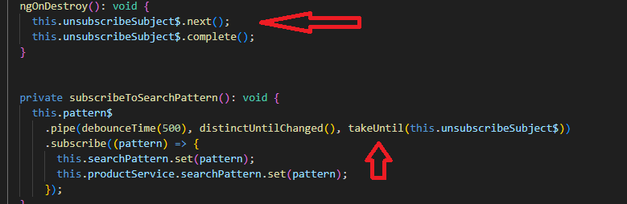

> U ovom primeru se koristi čest RxJS obrazac za upravljanje pretplatama u Angular komponenti. Sve pretplate koriste takeUntil(this.unsubscribeSubject$), gde unsubscribeSubject$ predstavlja Observable za uništavanje komponente.
>  Kada se komponenta uništi (ngOnDestroy), emituje se vrednost kroz unsubscribeSubject$, čime se automatski prekidaju sve aktivne pretplate, bez potrebe za ručnim unsubscribe() pozivima. Na ovaj način se sprečava curenje memorije i kod ostaje jednostavan i pregledan.

Nepravilno rukovanje pretplatama predstavlja jednu od glavnih mana RxJS biblioteke u jednostavnijim scenarijima i zahteva dodatnu pažnju prilikom razvoja aplikacije.

### Primer upotrebe RxJS u aplikaciji

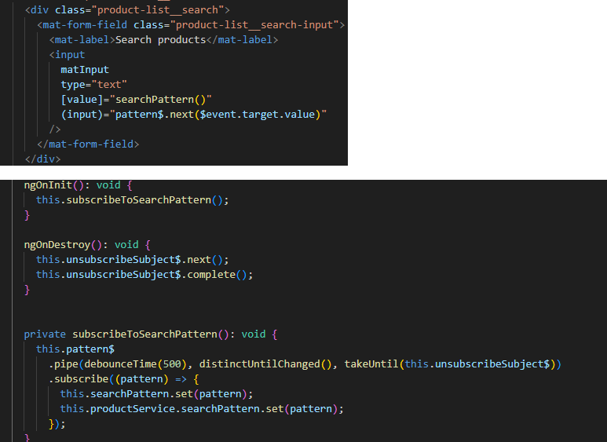

> U ovom primeru RxJS se koristi za reaktivnu obradu korisničkog unosa u _Search products_ polju. Svaka promena vrednosti u inputu emituje se kroz pattern$ Subject, umesto da se direktno reaguje na svaki input događaj.
>  Pretplata na pattern$ se uspostavlja u ngOnInit, gde se vrednosti dodatno obrađuju RxJS operatorima:
>
> - debounceTime(500) sprečava reagovanje na svako kucanje i čeka da korisnik napravi pauzu
> - distinctUntilChanged() obezbeđuje da se reaguje samo kada se vrednost zaista promeni
> - takeUntil(this.unsubscribeSubject$) automatski prekida pretplatu kada se komponenta uništi
>
> Kada se obrada završi, rezultat se prosleđuje dalje kroz searchPattern signal i servis, čime se omogućava sinhronizacija stanja između komponente i ostatka aplikacije.
> Na ovaj način RxJS je korišćen za kontrolu toka događaja, optimizaciju performansi i bezbedno upravljanje pretplatama, dok je sama logika aplikacije ostala čista i deklarativna.

<h2 id="angular-signals">🆕 Angular Signals</h2>

Angular Signals su nov reaktivni model koji je zvanično uveden u verziji 16, u maju 2023. godine, sa ciljem da omogući jednostavnije i preciznije upravljanje stanjem aplikacije. Signal se može posmatrati kao kontejner koji sadrži određenu vrednost (na primer broj ili tekst) i obaveštava ostale delove aplikacije kada se ta vrednost promeni. Kada se signal koristi, Angular automatski prati njegovu upotrebu, čime precizno zna gde i na koji način ta vrednost utiče na aplikaciju.

Signals API je mali i jednostavan za korišćenje i zasniva se na tri osnovne reaktivne primitive koje Angularu omogućavaju da zna kada i gde dolazi do promene podataka, čime se postiže efikasnije i preciznije ažuriranje korisničkog interfejsa.

Iako RxJS pruža snažan i fleksibilan mehanizam za rad sa asinhronim tokovima podataka, njegova primena u jednostavnim scenarijima upravljanja lokalnim stanjem često dovodi do povećane složenosti koda i potrebe za pažljivim upravljanjem pretplatama. Ovakvi slučajevi ukazali su na potrebu za jednostavnijim reaktivnim modelom, koji bi bio direktnije povezan sa stanjem i prikazom aplikacije.

Iz tog razloga, u novijim verzijama Angulara uveden je koncept Angular Signals, koji omogućava reaktivno upravljanje stanjem bez eksplicitnog rada sa tokovima i pretplatama, čime se pojednostavljuje razvoj UI logike u komponentama.

### Osnovni koncepti Signals API-ja

- Writable signals: osnovni signali čija vrednost može da se menja i koji obaveštavaju Angular kada dođe do promena;
- Computed signals: signali čija vrednost zavisi od drugih signala. Kada se signal od kojeg zavise promeni, automatski se menja i njihova vrednost;
- Effects: specijalne funkcije koje reaguju kada se vrednost signala promeni i može da pokrene sporedne efekte kao što su logovanje, rad sa DOM-om, itd. Važno je napomenuti da efekti ne vraćaju nove vrednosti.

Zahvaljujući ovim konceptima, Angular može da zna tačno gde i kada je potrebno izvršiti promene u interfejsu, bez potrebe za ručnim upravljanjem pretplatama ili oslobađanjem resursa. Angular automatski prati zavisnosti između signala i ažurira samo one delove aplikacije koji su direktno pogođeni promenom, što rezultuje boljim performansama, jednostavnijim kodom i jasnijom strukturom u poređenju sa tradicionalnim obrascima reaktivnosti.

#### Upotreba Angular Signals u _Shopping Cart_ aplikaciji

U okviru aplikacije, Angular Signals su korišćeni za upravljanje lokalnim stanjem i jednostavnom UI logikom, gde nije bilo potrebe za kompleksnim asinhronim tokovima podataka.

Signali su korišćeni u sledećim scenarijima:

- čuvanje trenutnog stanja korpe (broj stavki, količina proizvoda);
- izračunavanje izvedenih vrednosti, kao što je ukupna cena;
- reagovanje na promene stanja korpe kroz sporedne efekte (logovanje).

Ovim pristupom je demonstrirano kako se Angular Signals mogu koristiti za pojednostavljivanje reaktivnog koda i poboljšanje čitljivosti u poređenju sa tradicionalnim obrascima reaktivnosti.

#### Primeri korišćenja Angular Signals

> U ovom primeru koristi se _writable signal orders_ za čuvanje stanja porudžbina. Promena vrednosti signala vrši se pomoću metode **update**, čime se stanje ažurira nepromenljivo, a Angular automatski detektuje promene i ažurira korisnički interfejs.

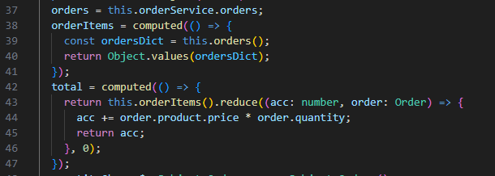

> U ovom primeru koriste se _computed signali_ za izvođenje novih vrednosti na osnovu postojećeg stanja. _orderItems_ predstavlja izvedenu vrednost dobijenu iz signala _orders_, dok je _total_ computed signal čija vrednost zavisi od liste porudžbina. Kada se promeni vrednost signala orders, oba computed signala se automatski ponovo izračunavaju.

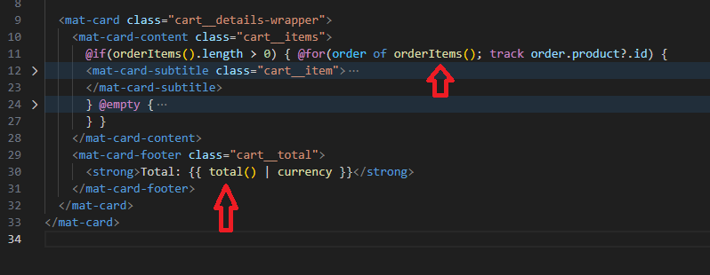

> Primer prikazuje kako se trenutna vrednost signala dobija pozivom signala, **orderItems()**, **total()**.

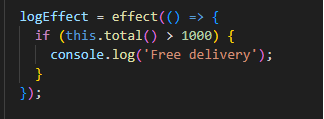

> Poslednji primer prikazuje korišćenje **effect** koncepta.

<h2 id="poredjenje-signala-i-rxjs-biblioteke">
  🆚 Poređenje signala i RxJS biblioteke
</h2>

RxJS i Angular Signals predstavljaju dva različita pristupa reaktivnosti u Angular aplikacijama, svaki sa jasno definisanom ulogom i oblastima primene. Iako oba mehanizma omogućavaju reagovanje na promene podataka, oni rešavaju različite probleme i zasnivaju se na drugačijem modelu razmišljanja.

RxJS je zasnovan na konceptu tokova podataka kroz vreme, gde se vrednosti emituju asinhrono i obrađuju pomoću Observables i bogatog skupa operatora. Ovakav pristup omogućava preciznu kontrolu nad redosledom izvršavanja, rukovanjem greškama, otkazivanjem i kombinovanjem više asinhronih izvora podataka. Međutim, ova fleksibilnost dolazi uz veću složenost koda, kao i potrebu za eksplicitnim upravljanjem pretplatama, kako bi se izbeglo curenje memorije i neželjeno ponašanje aplikacije.

Angular Signals, sa druge strane, uvode jednostavniji i sinhroni model reaktivnosti, fokusiran na trenutno stanje aplikacije i njegove zavisnosti. Promene se automatski prate bez potrebe za ručnim upravljanjem pretplatama, čime se smanjuje rizik od grešaka vezanih za životni ciklus i memoriju. Zbog toga su signali posebno pogodni za upravljanje lokalnim stanjem i UI logikom, gde nije potrebna kompleksna obrada asinhronih tokova.

| Aspekt                           | Angular Signals                         | Observables (RxJS)                                                                                                                                                                                                                                                                      |
| -------------------------------- | --------------------------------------- | --------------------------------------------------------------------------------------------------------------------------------------------------------------------------------------------------------------------------------------------------------------------------------------- |
| Osnovna namena                   | Upravljanje sinhronim, lokalnim stanjem | Upravljanje asinhronim tokovima podataka                                                                                                                                                                                                                                                |
| Tip reaktivnosti                 | Pull-based (čita se trenutna vrednost)  | Push-based (vrednosti se emituju tokom vremena)                                                                                                                                                                                                                                         |
| Vremenska dimenzija              | Fokus na trenutno stanje                | Fokus na tok vrednosti kroz vreme                                                                                                                                                                                                                                                       |
| Pretplate                        | Nisu potrebne                           | Potrebne (`subscribe / unsubscribe`)                                                                                                                                                                                                                                                    |
| Upravljanje memorijom            | Automatsko                              | Ručno upravljanje pretplatama (`unsubscribe`)                                                                                                                                                                                                                                           |
| Kompleksnost                     | Jednostavniji model                     | Složeniji, ali veoma moćan                                                                                                                                                                                                                                                              |
| Transformacije podataka          | Ograničene (computed vrednosti)         | Bogat skup operatora (`map`, `filter`, `switchMap`, itd.)                                                                                                                                                                                                                               |
| Rukovanje asinhronim operacijama | Nije primarna namena                    | Primarna namena                                                                                                                                                                                                                                                                         |
| Integracija sa UI                | Direktna i jednostavna                  | Posredna, kroz tokove                                                                                                                                                                                                                                                                   |
| Tipični use-case                 | Lokalno stanje, UI logika               | HTTP zahtevi, korisnički događaji (input, scroll), WebSocket komunikacija, kombinovanje više izvora podataka (combineLatest, merge, switchMap...), kompleksne transformacije i rukovanje greškama kroz operatore, scenariji gde je bitan tok vrednosti tokom vremena (intervali, retry) |

_Tabela je zasnovana na članku: https://dev.to/raju_dandigam/angular-signals-vs-observables-a-deep-dive-into-modern-reactivity-l03_

Pojavom Angular Signals pojavila su se očekivanja da bi oni mogli u potpunosti zameniti RxJS. Međutim, primeri implementirani u okviru _Shopping Cart_ aplikacije jasno pokazuju da ova dva pristupa imaju različite uloge.

Angular Signals su korišćeni za upravljanje lokalnim stanjem aplikacije i izvedenim vrednostima, kao što su stanje porudžbina (orders) i ukupan iznos (total), gde je jednostavnost i direktna povezanost sa UI-jem od ključnog značaja. Sa druge strane, RxJS je iskorišćen u scenarijima koji uključuju tokove događaja i asinhronu obradu, kao što je funkcionalnost pretraživanja proizvoda, gde su RxJS operatori omogućili kontrolu nad tokom i transformacijom podataka.

Ovi primeri pokazuju da Angular Signals ne zamenjuju RxJS, već ga dopunjuju, pri čemu kombinovana upotreba omogućava čistiji, čitljiviji i efikasniji kod.

## Arhitektura aplikacije

Aplikacija je razvijena korišćenjem Angular verzije 21, koja u potpunosti podržava moderan reaktivni pristup i napredne mehanizme za upravljanje stanjem aplikacije.

U cilju pojednostavljenja arhitekture i fokusa na klijentsku logiku i reaktivne obrasce, aplikacija ne koristi pravi backend servis. Umesto toga, korišćen je JSON Server kao zamena za backend, koji omogućava simulaciju REST API-ja i rad sa podacima na lokalnom nivou. Ovakav pristup omogućava jasno demonstriranje komunikacije sa spoljnim izvorima podataka bez dodatne kompleksnosti koja bi dolazila sa implementacijom serverske strane aplikacije.

Arhitektura aplikacije je podeljena na jasne celine kroz komponente (_app_, _welcome_, _product-list_, _product_, _cart_) i servise (_order.service.ts_, _product.service.ts_), gde se reaktivni obrasci koriste za upravljanje podacima, dok se poslovna logika i stanje aplikacije razdvajaju od prikaza. Poseban akcenat stavljen je na demonstraciju kako se moderni Angular mehanizmi mogu koristiti za postizanje čitljivog, održivog i skalabilnog koda u realnom primeru, poput _Shopping Cart_ aplikacije.

<h2 id="implementirane-funkcionalnosti">✨ Implementirane funkcionalnosti</h2>

U okviru _Shopping Cart_ aplikacije implementirane su osnovne funkcionalnosti tipične za e-commerce sistem, sa posebnim fokusom na demonstraciju reaktivnog upravljanja podacima i stanjem aplikacije.

- <h4>Upravljanje proizvodima</h4>

Aplikacija omogućava prikaz liste dostupnih proizvoda, koji se učitavaju sa simuliranog backend servisa korišćenjem JSON Server-a. Podaci o proizvodima se asinhrono preuzimaju i dostupni su komponentama aplikacije za dalju obradu i prikaz.

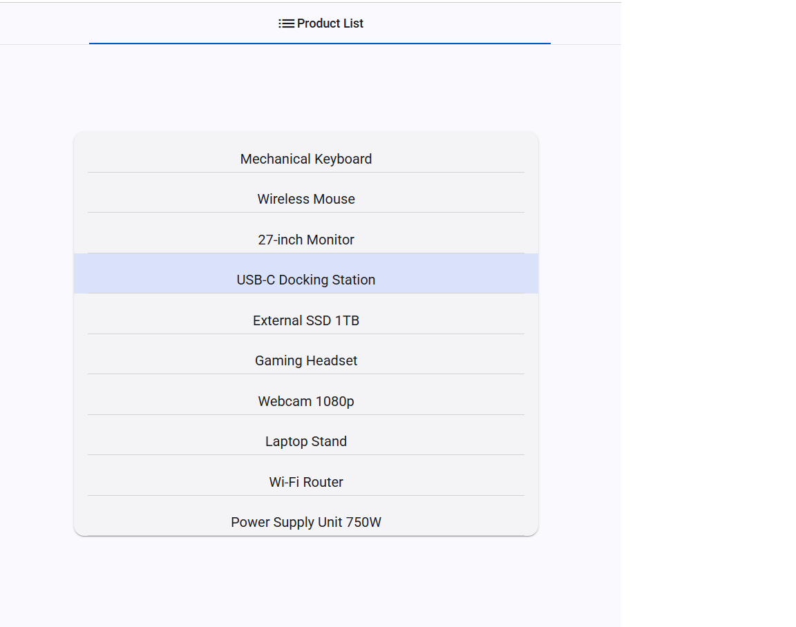

- <h4>Pretraživanje proizvoda</h4>

U ovom primeru prikazana je kombinovana upotreba RxJS observables i Angular Signals u okviru funkcionalnosti pretraživanja proizvoda. Korisnički unos se prvo obrađuje kao RxJS tok podataka, nakon čega se njegova vrednost pretvara u signal radi jednostavnijeg upravljanja stanjem. U nastavku, signal se po potrebi ponovo konvertuje u Observable kako bi se mogao kombinovati sa drugim asinhronim tokovima, dok se krajnji rezultat vraća u obliku signala za reaktivno ažuriranje korisničkog interfejsa.

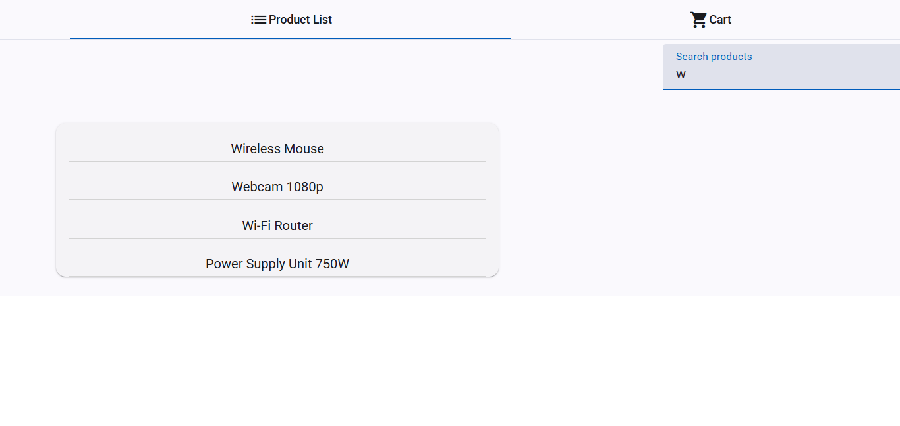

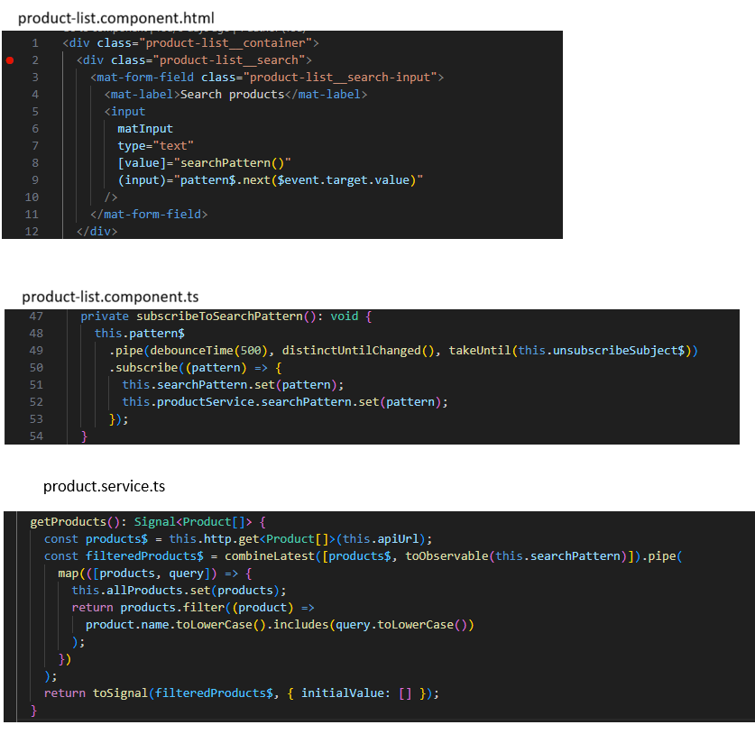

- <h4>Selekcija proizvoda i dodavanje u korpu</h4>

Klikom na proizvod iz liste, prikazujuju se karakteristike proizvoda, poput naziva, opisa, slike i cene. Korisnik može dodati proizvod u korpu. Promene u sadržaju korpe automatski se reflektuju u korisničkom interfejsu, čime se demonstrira reaktivno upravljanje stanjem aplikacije bez potrebe za ručnim osvežavanjem prikaza.

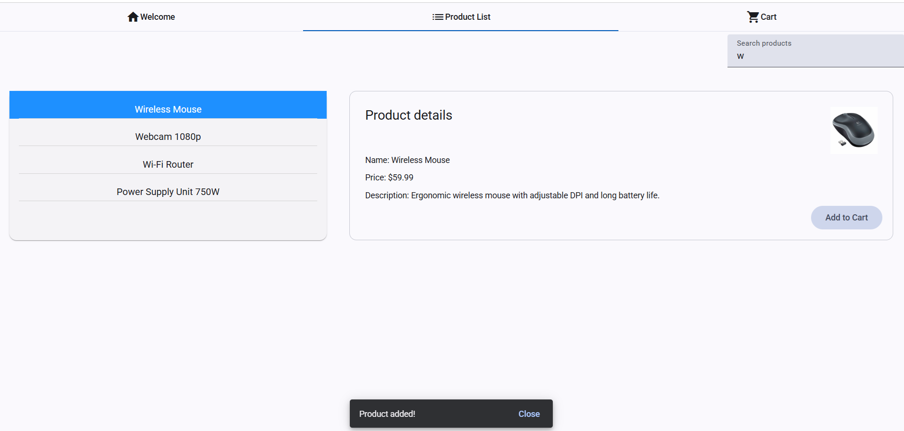

- <h4>Ažuriranje količine proizvoda i izračunavanje ukupne cene</h4>

Za svaki proizvod u korpi omogućena je izmena količine. Ukupna vrednost korpe i ukupan broj proizvoda se automatski ažuriraju u realnom vremenu, u zavisnosti od trenutnog stanja korpe.

Ukupna cena korpe računa se dinamički na osnovu trenutnog sadržaja i količine proizvoda. Ova vrednost predstavlja deriviranu informaciju koja zavisi od više ulaznih podataka, što čini dobar primer primene reaktivnog pristupa.

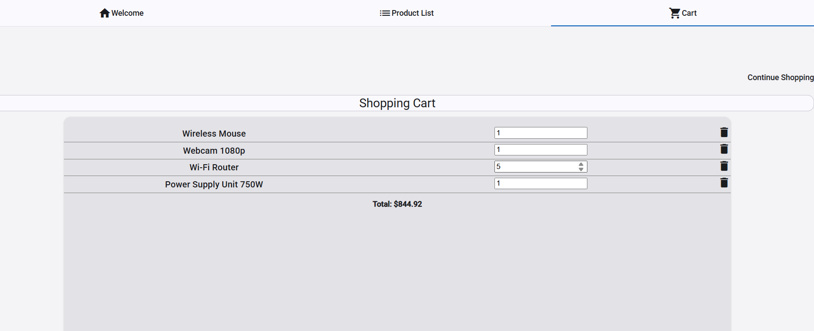

- <h4>Uklanjanje proizvoda</h4>

Klikom na ikonu, proizvod se uklanja iz korpe i ažurira se stanje.

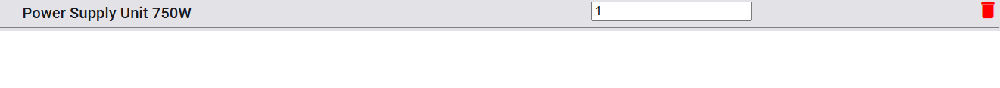

- <h4>Sinhronizacija stanja i prikaza</h4>

Sve promene u stanju aplikacije trenutno se odražavaju u prikazu, bez dodatnih ručnih intervencija. Time se obezbeđuje konzistentnost između podataka i korisničkog interfejsa, kao i jasno razdvajanje poslovne logike od prikaza.

- <h4>Povratak na kupovinu</h4>

Klikom na _Continue Shopping_ korisnik opet može videti dostupnu listu proizvoda.

<h2 id="pokretanje-aplikacije">🚀 Pokretanje aplikacije</h2>

Da bi se aplikacija pokrenula lokalno, potrebno je imati instalirane sledeće alate:

- Node.js (preporučena LTS verzija)
- Angular CLI (verzija >=16)

_Videti kompatibilne pakete za Angular verziju 21 (korišćena u projektu): (https://angular.dev/reference/versions)_

1. Kloniranje repozitorijuma

- git clone [<URL_repozitorijuma>](https://github.com/anitagolubovic/SignalsAndRxJs.git)
- cd SignalsAndRxJs

2. Instalacija zavisnosti

- Preporučeno (projekt koristi Yarn): `yarn install`
- Alternativno (ako koristite npm): `npm install`

3. Pokretanje JSON Server-a (mock API)

- Pokrenite: `yarn fake-api` ili `npm run fake-api`
- Podrazumevani port JSON Server-a je **3000**. Za eksplicitno pokretanje na portu 3000 koristite:
  - `npx json-server --watch db.json --port 3000`
  - ili `npm run fake-api -- --port 3000` (ako koristite npm)

Ova komanda pokreće lokalni server koji služi podatke definisane u `db.json` fajlu.

4. Pokretanje Angular aplikacije

U drugom terminalu pokrenuti Angular aplikaciju:

- `ng serve` (ili `yarn start` / `npm start`)

Nakon uspešnog pokretanja, aplikacija je dostupna na adresi: http://localhost:4200

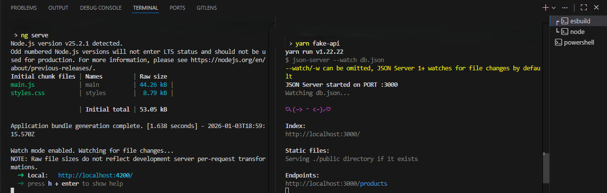

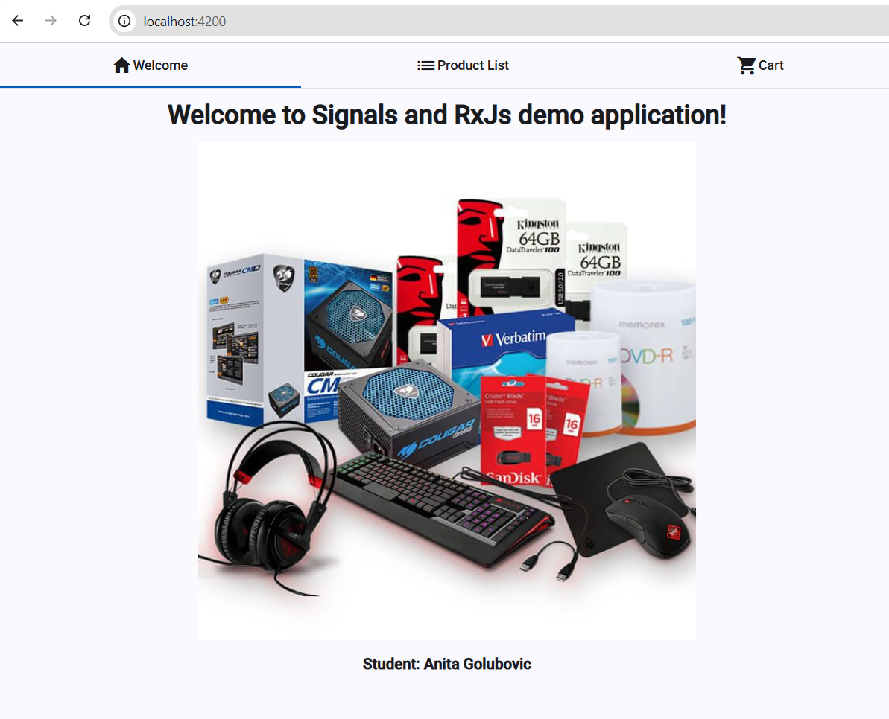

<h2 id="zakljucak">Zaključak</h2>

Kroz projekat _Shopping Cart_ prikazana je praktična primena reaktivnog programiranja u Angularu, sa posebnim fokusom na savremene mehanizme koje framework nudi. Projekat je pokazao kako se različiti reaktivni pristupi mogu koristiti za efikasno upravljanje stanjem aplikacije i sinhronizaciju podataka sa korisničkim interfejsom.

Uporedna primena RxJS-a i Angular Signals omogućila je sagledavanje njihovih razlika, prednosti i ograničenja u realnom kontekstu. Dok je RxJS nezamenljiv za rad sa asinhronim tokovima podataka i složenijom poslovnom logikom, Angular Signals su se pokazali kao jednostavno i čitljivo rešenje za upravljanje lokalnim stanjem i UI logikom. Najbolji rezultati postižu se njihovom kombinovanom upotrebom, gde svaki pristup ima jasno definisanu ulogu.

## Mogućnosti daljeg razvoja

Iako aplikacija u trenutnom obliku pokriva osnovne funkcionalnosti _Shopping Cart_ sistema, postoji više pravaca u kojima bi projekat mogao dodatno da se razvija i unapredi.
 Jedna od mogućnosti je uvođenje pravog backend servisa, čime bi se omogućila autentikacija korisnika, upravljanje porudžbinama i trajno čuvanje podataka. Time bi se dodatno demonstrirala primena reaktivnih tokova u komunikaciji sa realnim API-jem.
 Dalji razvoj mogao bi uključiti naprednije upravljanje stanjem aplikacije, kao što su podela globalnog i lokalnog stanja, kao i jasnije definisani obrasci za kombinovanje RxJS-a i Angular Signals u većim aplikacijama.
